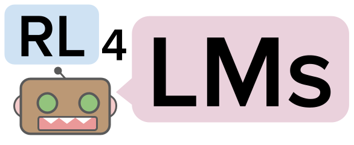

<p align="center">
  
</p>

<h1 align="center"> :robot: RL4LMs :rocket: </h1>

<h3 align="center"> A modular RL library to fine-tune language models to human preferences </h3>

<br>

We provide easily customizable building blocks for training language models including implementations of **on-policy algorithms**, **reward functions**, **metrics**, **datasets** and **LM based actor-critic policies**

Paper Link: https://arxiv.org/abs/2210.01241

Website Link: https://rl4lms.apps.allenai.org/

Thoroughly **tested** and **benchmarked** with over **2000 experiments** :fire: (GRUE benchmark :trophy:) on a comprehensive set of: 
- 6 different Natural Language Processing (NLP) Tasks:
    - Summarization
    - Generative Commonsense Reasoning
    - IMDB Sentiment-based Text Continuation
    - Table-to-text generation
    - Abstractive Question Answering
    - Machine Translation
- Different types of NLG metrics (20+) which can be used as reward functions:
    - Lexical Metrics (eg: ROUGE, BLEU, SacreBLEU, METEOR)
    - Semantic Metrics (eg: BERTSCORE, BLEURT)
    - Task specific metrics (eg: PARENT, CIDER, SPICE)
    - Scores from pre-trained classifiers (eg: Sentiment scores)
- On-policy algorithms of PPO, A2C, TRPO and novel **NLPO (Natural Language Policy Optimization)**
- Actor-Critic Policies supporting causal LMs (eg. GPT-2/3) and seq2seq LMs (eg. T5, BART)

All of these building blocks can be customizable allowing users to train transformer-based LMs to optimize any arbitrary reward function on any dataset of their choice.

---
# Install

## Local Installation 
```bash
git clone https://github.com/allenai/RL4LMs.git
cd RL4LMs
pip install -e .
```

## Docker
We provide also a Dockerfile for development using docker containers containing all the dependencies.
```bash
docker build . -t rl4lms
```

## Additional dependencies

Optionally, coreNLP libraries are required for certain metric computations (eg. SPICE) which can be downloaded through `cd rl4lms/envs/text_generation/caption_metrics/spice && bash get_stanford_models.sh`

---
# Quick Start - Train PPO/NLPO using pre-defined YAML configs
We provide a simple training API that can be invoked via train [script](https://github.com/allenai/RL4LMs/blob/main/scripts/training/train_text_generation.py) that allows to train PPO, NLPO or a supervised model by using a config file (YAML). 

For example, to train T5-base on CNN/DM summarization on PPO using Rouge-1 as reward function, you can run:

```bash
python scripts/training/train_text_generation.py --config_path scripts/training/task_configs/summarization/t5_ppo.yml
```

Config files for all tasks can be found [here](https://github.com/allenai/RL4LMs/tree/main/scripts/training/task_configs).

## YAML file schema - Configuring building blocks

Config file contains details about hyper-parameter settings for building blocks which are described below:

- **Dataset/Task**: Dataset containing samples with input prompts and reference sentences. Available datasets are found in the class `DataPoolRegistry` in [registry](https://github.com/allenai/RL4LMs/blob/main/rl4lms/envs/text_generation/registry.py). (See how to create your own dataset [here](#adding-dataset))

  ```yaml
  datapool:
    id: cnn_daily_mail
    args:
      prompt_prefix: "Summarize: "
  ```

- **Tokenizer** - A pre-trained tokenizer that is used to (de)tokenize input and output sequences with settings for padding and truncation
  ```yaml
  tokenizer:
    model_name: t5-base
    padding_side: left
    truncation_side: left
    pad_token_as_eos_token: False
  ``` 
- **Reward Function**: Reward function which computes token-level scores at each time step of MDP. Available reward functions can be found in the class `RewardFunctionRegistry`. (See how to create your own reward function [here](#adding-reward-function))

  ```yaml
  reward_fn:
    id: rouge
    args:
      rouge_type: "rouge1"
  ```

- **Environment**: Configures a gym-style text generation [environment](https://github.com/allenai/RL4LMs/blob/main/rl4lms/envs/text_generation/env.py) which simulates MDP episodes. Rollouts are generated using train samples from dataset consisting of input and reference texts.
Further, we wrap our env with `SubProcVecEnv` from stable-baselines that processes `n_envs` episodes in parallel using multi-processing to compute step-wise rewards.  
Further configuration settings include: 
  - `max_episode_length` : max length of the episode 
  - `max_prompt_length` - maximum length of the input text to consider 
  - `terminate_on_eos` - whether to terminate the episode as soon as EOS action is performed 
  - `prompt_truncation_side` - truncation side for the prompt text 
  - `context_start_token` - id for context token (corresponds to initial token given to decoder in encoder-decoder models)

  ```yaml
  env:
    n_envs: 10
    args:
      max_prompt_length: 512
      max_episode_length: 100
      terminate_on_eos: True
      prompt_truncation_side: "right"
      context_start_token: 0
  ```

- **On-policy alg**: We provide implementations of 4 on-policy algorithms: PPO, NLPO, A2C and TRPO adapted from [stable-baselines3](https://github.com/DLR-RM/stable-baselines3) tailored to work with NLP tasks which can be used out-of-the-box with either a causal policy or a seq2seq LM policy. (See how to create your own [on-policy algorithm](#adding-custom-on-policy-algorithms) or [policy](#adding-custom-policies))
  - We also provide a supervised [trainer](https://github.com/allenai/RL4LMs/blob/2863116cd5860e4a4106a76486e70bfac25df2ba/rl4lms/envs/text_generation/training_utils.py#L225) for benchmarking purposes. Supervised Warm start models are already uploaded to Huggingface Hub and specified in the respective config files.
  - Hyper-parameters for the algorithm can be specified at `alg/args`. 
  - Further, all RL algorithms use adaptive KL controller to keep the LM close to original LM by setting initial KL co-efficient (`alg/kl_div/coeff`) and target KL (`alg/kl_div/target_kl`). 
  - We support two types of LM policy: **causal LM policy** (for decoder only models) and **seq2seq LM policy** (for encoder-decoder models). Further for NLPO, we also provide maskable variants of these. Policy implementations can be found [here](https://github.com/allenai/RL4LMs/blob/main/rl4lms/envs/text_generation/policy.py) in and it can be attached to algorithms by specifying `alg/policy/id` and `alg/policy/args`

    ```yaml
    alg:
      id: ppo
      args: 
        n_steps: 512
        batch_size: 64
        verbose: 1
        learning_rate: 0.000002
        n_epochs: 5
        ent_coef: 0.0
      kl_div:
        coeff: 0.001
        target_kl: 0.2
      policy:
        id: seq2seq_lm_actor_critic_policy
        args:
          model_name: t5-base
          apply_model_parallel: True
          prompt_truncation_side: "right"
          generation_kwargs:
            do_sample: True
            top_k: 50
            min_length: 50
            max_new_tokens: 100          
    ```

- **Trainer Config**: We provide an [On-policy trainer](https://github.com/allenai/RL4LMs/blob/2863116cd5860e4a4106a76486e70bfac25df2ba/rl4lms/envs/text_generation/training_utils.py#L126) - a feature-complete wrapper that instantiates building blocks from their corresponding configs and provides an outer training loop consisting of *train* and *eval* iterations `train_evaluation/n_iters`. 
  - Each iteration corresponds to performing updates with `alg/args/n_steps` x `env/n_envs` of the chosen algorithm. 
  - For every `eval_every` iters, LM is evaluated on validation split using metrics listed in `train_evaluation/metrics` with generation kwargs provided in `train_evaluation/generation_kwargs` (this overrides rollout `alg/policy/generation_kwargs` for inference purposes only)

  ```yaml
  # train and evaluation
  train_evaluation:
    eval_batch_size: 100
    n_iters: 100
    eval_every: 10
    save_every: 1
    metrics:
      - id: meteor
        args: {}
      - id: rouge
      - id: bleu
        args: {}
      - id: bert_score
        args:
          language: en
      - id: diversity
        args: {}
    generation_kwargs: 
      do_sample: True
      top_k: 0
      temperature: 0.7
      min_length: 50
      max_new_tokens: 100
  ```

---
# Custom Building Blocks :wrench:
RL4LMs provide complete customizability - with respect to adding new tasks/datasets, reward functions, evaluation metric, on-policy algorithms and actor-critic policies.

## Adding dataset
Users can create their own datasets by sub-classing [TextGenPool](https://github.com/allenai/RL4LMs/blob/af5a1326578789856ca8550cb5496c9ccc1afdc5/rl4lms/data_pools/text_generation_pool.py#L15) just by overriding `prepare(cls, split: str, **args) -> 'TextGenPool':` method to return an instance of TextGenPool. An example is shown below:


 ```python
 from rl4lms.data_pools.text_generation_pool import Sample, TextGenPool

 class MyDataPool(TextGenPool):
    @classmethod
    def prepare(cls, split: str):
        .. 
        samples = []
        for ix, item in enumerate(..):
            sample = Sample(id=f"{split}_{ix}",
                            prompt_or_input_text=item["document"],
                            references=[item["target"]]
                            )
            samples.append(sample)
        pool_instance = cls(samples)
        return pool_instance

```

## Adding reward function
Custom reward funtions can be implemented easily by sub-classing [RewardFunction](https://github.com/allenai/RL4LMs/blob/af5a1326578789856ca8550cb5496c9ccc1afdc5/rl4lms/envs/text_generation/reward.py#L12) (a callable) which takes observation ($s$), next observation ($s'$), action ($a$), done (indicating whether episode is finished) and meta info (containing other information about textual input). Here, [Observation](https://github.com/allenai/RL4LMs/blob/af5a1326578789856ca8550cb5496c9ccc1afdc5/rl4lms/envs/text_generation/observation.py#L11) is a data class object consisting of generated text (at a particular step), prompt text, context text (at that step), reference text which can be used to compute token-level or sentence level rewards.


 ```python
from rl4lms.envs.text_generation.observation import Observation
from rl4lms.envs.text_generation.reward import RewardFunction


class MyRewardFunction(RewardFunction):
    def __init__(self, *args) -> None:
        super().__init__()

    def __call__(self, prev_observation: Observation,
                 action: int,
                 current_observation: Observation,
                 done: bool,
                 meta_info: Dict[str, Any] = None) -> float:
        if done:
            reward = ..
            return reward
        return 0
 ```

:bulb:
In addition to traditional NLG metrics, for quick prototyping, we provide two synthetic reward functions which trains LMs to [generate numbers](https://github.com/allenai/RL4LMs/blob/af5a1326578789856ca8550cb5496c9ccc1afdc5/rl4lms/envs/text_generation/test_reward.py#L8) in increasing order and [generate dates](https://github.com/allenai/RL4LMs/blob/af5a1326578789856ca8550cb5496c9ccc1afdc5/rl4lms/envs/text_generation/test_reward.py#L54). These can be used to quickly test different algorithms and policies. Corresponding configs can be found here ([numbers](https://github.com/allenai/RL4LMs/tree/main/scripts/training/task_configs/synthetic_generate_increasing_numbers), [dates](https://github.com/allenai/RL4LMs/tree/main/scripts/training/task_configs/synthetic_generate_dates))


## Adding custom metrics
Users can create their own evaluation metric which then will be used to periodically evaluate the model on validation split of dataset. This can be done by sub-classing [BaseMetric](https://github.com/allenai/RL4LMs/blob/af5a1326578789856ca8550cb5496c9ccc1afdc5/rl4lms/envs/text_generation/metric.py#L20) which takes prompt texts, generated texts, reference texts, meta_infos, current LM model, split name as inputs and returns a dict with metric name as key and value consisting of tuple of sentence-level scores and corpus level scores. An example is as follows:

 ```python

from rl4lms.envs.text_generation.metric import BaseMetric

class MyMetric(BaseMetric):
    def __init__(self) -> None:
        super().__init__()

    def compute(self,
                prompt_texts: List[str],
                generated_texts: List[str],
                reference_texts: List[List[str]],
                meta_infos: List[Dict[str, Any]] = None,
                model: PreTrainedModel = None,
                split_name: str = None):
        metric_dict = {
            "custom_metrics/my_metric": ([0.4, 0.7, 0.9], 0.7)
        }
        return metric_dict
 ```

## Adding custom on-policy algorithms

In addition to supported on-policy algorithms (PPO, NLPO, A2C,TRPO), users can implement their own on-policy algorithms with ease by sub-classing stable-baselines3's [OnPolicyAlgorithm](https://github.com/DLR-RM/stable-baselines3/blob/a697401e032dd4fecbbd4162755ddd707df980d3/stable_baselines3/common/on_policy_algorithm.py#L20). Since we provide [wrappers](https://github.com/allenai/RL4LMs/blob/af5a1326578789856ca8550cb5496c9ccc1afdc5/rl4lms/envs/text_generation/alg_wrappers.py#L67) for on-policy algorithms that handles rollouts using LM policies, environment, computing rewards etc, users just need to implement `train()` method with custom loss functions. 

```python
from stable_baselines3.common.on_policy_algorithm import OnPolicyAlgorithm

class MyOnPolicyAlgorithm(OnPolicyAlgorithm):
    def __init__(**args):
        super().__init__(**args)

    def train(self) -> None:
        # train for n_epochs epochs
        for epoch in range(self.n_epochs):
            # Do a complete pass on the rollout buffer
            for rollout_data in self.rollout_buffer.get(self.batch_size):
              # compute loss
```

## Adding custom policies

We provide LM based actor-critic policy [implementations](https://github.com/allenai/RL4LMs/blob/main/rl4lms/envs/text_generation/policy.py) that wraps causal LM and seq2seq LMs. These can be also extended (for eg: use a different critic architecture) by overriding appropriate methods (eg. `evaluate_actions()`)

## Registry
Finally, just register your custom components by adding them to corresponding [registry](https://github.com/allenai/RL4LMs/blob/main/rl4lms/envs/text_generation/registry.py), after which they can be used directly from configs similar to pre-defined components :wave:

---

# Logging and Experiment Results

Additionally, we support WANDB logging and warm-starting of training by storing checkpoints and other training artifacts in a user-specified path. This is especially useful for running preemptible jobs on large, scheduled clusters.

Artifacts include (1) jsonl file containing rollout infos at specified intervals (2) jsonl file containing training infos at specified intervals (3) jsonl file containing validation metrics at specified intervals (4) jsonl file containing test metrics before and after training (5) json file with validation predictions at specified intervals (6) json file with test predictions before and after training (7) trained LM model (8) config json used to run the experiment

Complete usage is as follows:

```bash 
WANDB_API_KEY=<YOUR-WANDB-API-KEY-HERE>  python scripts/training/train_text_generation.py \
--config_path <PATH-TO-CONFIG-FILE> \
--experiment_name <EXPERIMENT-NAME> \
--base_path_to_store_results <PATH-TO-STORE-RESULTS> \
--log_to_wandb
```

---

# Citation

```bibtex
@inproceedings{Ramamurthy2022IsRL,
  title={Is Reinforcement Learning (Not) for Natural Language Processing?: Benchmarks, Baselines, and Building Blocks for Natural Language Policy Optimization},
  author={Rajkumar Ramamurthy and Prithviraj Ammanabrolu and Kiant{\'e} Brantley and Jack Hessel and Rafet Sifa and Christian Bauckhage and Hannaneh Hajishirzi and Yejin Choi},
  journal={arXiv preprint arXiv:2210.01241},
  url={https://arxiv.org/abs/2210.01241},
  year={2022}
}
```

# Questions/Discussion/Ideas?

For discussion, questions, ideas exchange, join our slack channel 
[](https://join.slack.com/t/slack-1sa3880/shared_invite/zt-1idqlnbnm-NIiZeMIOpYReXfX9uIT_PA)

